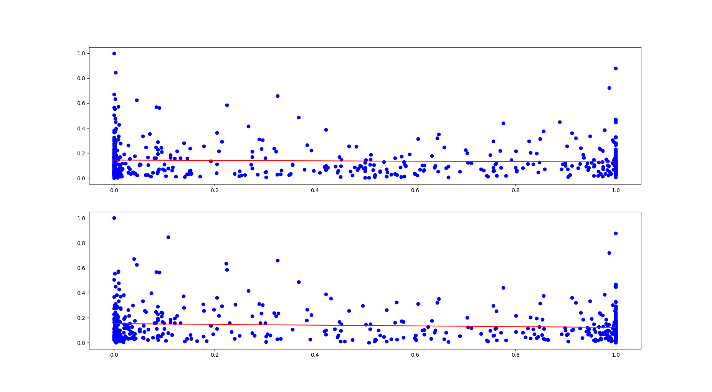

# Отчет по лабораторной работе
## по курсу "Искусственый интеллект"

## Исследование друзей вконтакте с помощью Face API / Vision API

### Студенты: 

| ФИО       | Роль в проекте                     | Оценка       |
|-----------|------------------------------------|--------------|
|Сахарин Н.А| Весь проект                        |   3.5           |


## Результат проверки

| Преподаватель     | Дата         |  Оценка       |
|-------------------|--------------|---------------|
| Сошников Д.В. |   19.06.18           |   3.5            |

> Опоздание в сдаче отчета >2 недель

## Тема работы
Номер по списку - 15
  1) Берем аккаунты своих друзей. Если друзей менее 100 - берем аккаунты друзей своего друга, у которого более 100 друзей
Опишите тему работы и конкретное задание для выполнения (с указанием номера варианта).
  2) Изучить, есть ли зависимость количества лайков фотографий от среднего уровня счастья и максимальной амплитуды эмоций людей на фотографии. При вычислении амплитуды эмоций необходимо отбрасывать нейтральную эмоцию. Исследовать по 100 фотографий для каждого пользователя. Количество лайков нормировать для всех 100 фотографий (делить на максимальное).

## Отчет по ходу работы
В силу категорически слабого интернета (постоянные обрывы соединения) мне пришлось изменить архитектуру программы.
Программа состоит из 3 частей:
1) ```retrieve_photo()``` - генерирует .csv файл, каждая строка которого имеет вид ```('url-адрес фотографии', 'кол-во лайков')```.
На этом этапе используются vk.API, для получения списка людей по id-пользователя, а затем, получение фотографий пользователя из профиля. Адреса полученных фотографий помещаются в файл.

Например, первые 5 строк полученного файла:
```
https://pp.userapi.com/c4180/v4180394/d2/PuLAG-MA-mw.jpg,    6
https://pp.userapi.com/c4180/v4180394/5a7/-UV4MMIqzlI.jpg,   4
https://pp.userapi.com/c5497/v5497394/65/6KgnKXT_oD0.jpg,    9
https://pp.userapi.com/c10680/v10680394/7a3/z_Oaxg8938k.jpg, 9
https://pp.userapi.com/c5740/v5740394/bfa/MwUclT3nGi0.jpg,   10
```
2) ```emotion_recognition()``` - по файлу полученному на предыдущем этапе, получаем новый файл, имеющий вид ```('средний уровень счастья', 'Максимальная амплитуда эмоций', 'кол-во лайков')```.
Используется cognitive_face (FaceAPI), для извлечения информации из фото. FaceAPI.face.detect возвращает список лиц обнаруженных на фото. Для каждого распознанного лица анализируется поле 'faceAttributes', откуда и нужная информация. Максимальная амплитуда эмоций определяется следующим образом: для каждого лица на фотографии определяется эмоция с небольшим  и наименьшем значением (все значения эмоций расположены на отрезке \[0, 1\], а их сумма равна единице). В итоге, каждому лицу обнаруженному на фото, ставится в соответствие разность наибольшего и наименьшего значений эмоции. Выбирается максимальная из этих разность - это и есть максимальная амплютуда.

Например, первые 5 строк полученного файла:
```
happiness amplitude likes_count
0.015,    0.015,    6
0.141,    0.141,    4
1.0,      1.0,      9
1.0,      1.0,      9
0.0625,   0.865,    10
```
3) ```evaluate_dependence()``` - по файлу полученному на предыдущем этапе строится модель линейной регресии. А именно исследуется зависимость: ```likes_count ~ happiness + amplitude```. Визуализировав результаты получим изображение.


Полученное изображение указывает на то, что трудно установить закономерность между количеством лайков и уровнем счастья и амплютудой эмоций.

## Выводы
Важно отметить, что полученная программа является отказоустойчивой. А именно, в силу того, что лимит запросов к сервису ограничен 20 разпросами в минуту, что бы не возникало исключений в связи превышением лимита запроса полсле каждого запроса было установленно время ожиданий функцией ```time.sleep(2)```, прерывающей выполение на 2 секунды. Что в случае моего медленного интернета гарантировало, что кол-во запросов не превысит лимит.

Иной проблемой, с которой я столкнулся, были постоянные обрывы соединения. Каждый раз когда во время выолнения ```emotion_recognition``` когда обрывалось соединение, программа отлавливала исключение, а затем выводила кол-во уже обработанных фотографий. Затем, требовалось вручную перезапустить программу с значением уже обработанных фотографий в качестве аргумента коммандной строки. Программа возобновляла работу с нужного места. Вызов без аргументов соотвествует обработке фотографий с самого начала.

API cognitive_face предоставляет и иные возможности. В частности можно оценить по распознанному лицу возраст человека и узнать пол. При этом можно отметить некоторую аномалию. В частности 6% обработанных фотографий имели значение одной из эмоций равное 1 и остальные значения равные 0. Это не соответствует реальному восприятию эмоций.
